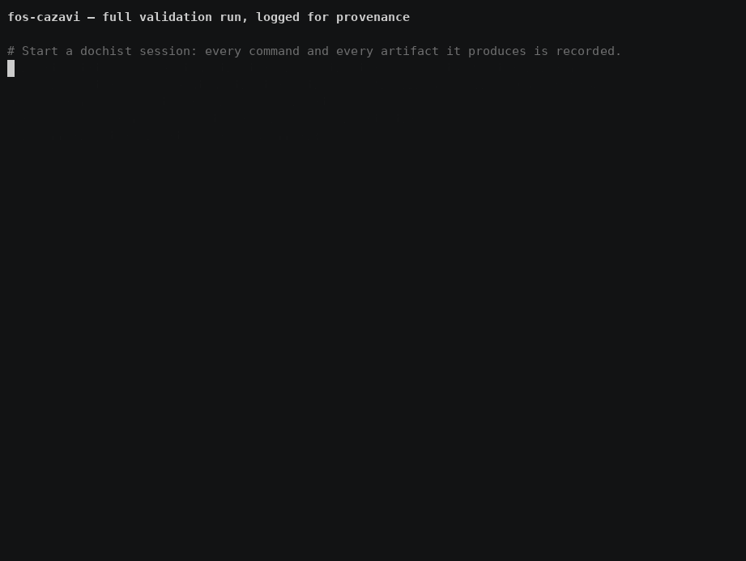

# Demo recording



> **Stale.** This recording predates the two ESKAPE-fosfomycin GOLD sets (36
> genomes, real MIC-tested *K. pneumoniae* and *P. aeruginosa*) and the fixes
> they drove — the *P. aeruginosa* fosfomycin call shown here (`Resistant`)
> is the since-corrected behaviour; it is `Indeterminate` now. See
> [`docs/VALIDATION.md`](../docs/VALIDATION.md) for the current numbers.
> Re-record with `scripts/record_demo.sh --record` to refresh it.

`validation-run.gif` shows the validation as it stood at recording time — 52
assemblies across six published genome sets and three species — run through
`fos-cazavi batch` and logged with
[dochist](https://github.com/motroy/dochist-docs) so the session doubles as
the provenance record.

The raw, replayable recording is [`validation-run.cast`](validation-run.cast):

```sh
asciinema play demo/validation-run.cast
```

## Re-recording

```sh
scripts/record_demo.sh --record
```

That runs the real analysis (nothing is staged or faked), records it with
`asciinema`, and renders the GIF with [`agg`](https://github.com/asciinema/agg).
The GIF is rendered at 2× so the ~35 s run reads quickly.

Requirements: `asciinema`, `agg`, `dochist`, plus the pipeline's own
dependencies (BLAST+, and optionally GAMMA and seqkit). Assemblies are read
from `.validation_genomes/`, which `scripts/run_validation.sh` populates from
NCBI on first use.

## What the recording produces

| Output | What it is |
|---|---|
| [`../docs/PROVENANCE.md`](../docs/PROVENANCE.md) | FAIR compliance report: every command, every artifact, SHA-256 checksums |
| [`../scripts/rerun_validation.sh`](../scripts/rerun_validation.sh) | Curated reproduction script, extracted from the session's successful commands |
| [`../requirements.txt`](../requirements.txt) | Python environment snapshot taken during the session |
| `../bioproject_tests/all_validation_combined_summary.tsv` | One row per sample, across all six sets |
| `.dochist/sessions/` | The session itself, as plain JSON |
